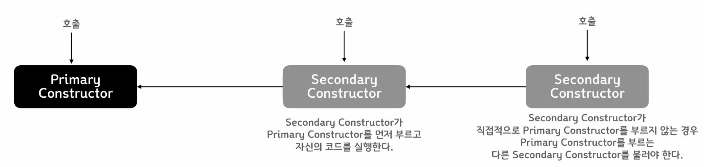
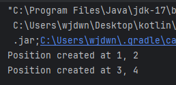
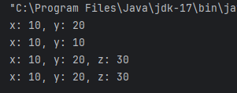

# Classes

#### Class

- class 키워드로 선언한다
- class의 구성
  - **header** : 클래스 이름 다음부터 { 까지. constructor, 상속 등을 정의
  - **body** : {} 로 정의된 코드 영역
- Java와 다른 점
  - class의 access keyword - public 생략 가능
  - 객체 생성자를 부를 때 **new 를 적지 않는다**
  - header 와 body 가 모두 선택사항이다

#### Constructor

- **하나의 Primary Constructor** 와 **여러 개의 Secondary Constructor **로 구성할 수 있다
- **Primary Constructor는 반드시 호출되어야 한다**



- Primary Constructor는 header 영역에 정의된다

```kotlin
class Person constructor(firstName: String) { /*...*/ }
```

- Primary Constructor에 annotation도 없고 visibility 가 public 일 경우 다음과 같이 constructs 키워드를 생략하고 줄여쓸 수 있다

```kotlin
class Person(firstName: String) { /*...*/ }
```

- Primary Constructor로 전달 된 파라미터는 클래스 Body 내의 변수 초기화에 사용할  수 있다.  
- 초기화 코드가 필요할 경우 init { } 블록을 추가하여 작성 할 수 있다.  
  - init 블록은 Primary Constructor이다.  
  - init 블록이 여러 개 있으면 위에서 아래 순으로 실행된다.

```kotlin
class Student(birthYear:Int) {
    private val age = LocalDateTime.now().year - birthYear
    init {
        println("Student's age is $age")
    }
    init {
        println("Second init block.")
    }
}
```

<br />

#### 실습

- 인자를 받지 않는 생성자를 가진 Test 클래스를 선언하고 객체를 생성한다

```kotlin
class Test

fun main() {
    val test = Test()
}
```

- 정수형 value property x, y를 가지는 Position class를 정의
- Primary constructor 에서 정수형 숫자 2개를 받아서 property x, y를 초기화
- 객체를 2개 이상 생성

```kotlin
class Position(x: Int, y: Int) {
    val x = x
    val y = y

    init {
        println("Position created at $x, $y")
    }
}

fun main() {
    val p1 = Position(1,2)
    val p2 = Position(3,4)
}
```



- Primary Constructor에서 property 선언과 초기화를 한번에 할 수 있다
- Class property 도 할당 횟수에 따라 val, var로 구분하여 사용한다

```kotlin
class Person(val firstName: String, val lastName: String, var age: Int)
```

<br />

- 앞에서 작성한 Position 클래스에서 x, y 변수를 생성자에서 바로 선언하고 초기화하도록 코드를 수정하라

```kotlin
class Position(val x: Int, val y:Int) {
    init {
        println("Position created at $x, $y")
    }
}

fun main() {
    val p1 = Position(1,2)
    val p2 = Position(3,4)
}
```


#### Secondary constructor

- constructor 키워드를 이용해 class body에 선언한다
- 직접적 또는 간접적으로 Primary constructor를 호출해야 한다

```kotlin
class Person(val name: String) {
    val children: MutableList<Person> = mutableListOf()
    constructor(name: String, parent: Person) : this(name) {
        parent.children.add(this)
    }
}
```

<br />

- 앞서 작성한 Position 클래스에 정수형 파라미터 하나만을 받아 x,y 모든 변수에 해당 값을 설정하는 Secondary Constructor를 추가하라

```kotlin
class Position(val x: Int, val y:Int) {
    constructor(value:Int):this(value, value)
    init {
        println("x: $x, y: $y")
    }
}

fun main() {
    val p1 = Position(1,2)
    val p2 = Position(3,4)
    val p3 = Position(3)
}
```

#### Inheritance

- 모든 클래스의 최상위 부모는 Any: 부모가 명시되지 않은 경우 Any의 자식 클래스
- 클래스는 기본적으로 final 처리되어 상속 불가능
- 상속을 허용하려면 open 키워드를 사용해야 한다

```kotlin
open class Base // Class is open for inheritance
```

- 부모 클래스를 지정하려면 header 뒤에 : 부모클래스() 와 같이 적는다
  - 부모 클래스의 Constructor를 호출하는 형태로 적어야 한다

```kotlin
open class Parent

class Child: Parent()

----------------------------
open class Parent(v:Int)

class Child: Parent(0)

----------------------------
open class Parent(v:Int)

class Child(v:Int): Parent(v)
```

- 만약 자식 클래스에 primary constructor가 없다면 각 secondary constructor에서  super 키워드를 이용해 초기화 하거나 다른 secondary constructor를 이용해서 부모  클래스를 초기화한다.

```kotlin
open class Parent { 
    constructor(v:Int){ } 
    constructor(v1:Int, v2:Int){ } 
}
```

```kotlin
open class Parent(v:Int) { 
    constructor(v1:Int, v2:Int):this(v1){ } 
} 
class Child: Parent{ 
    constructor(v:Int):super(v) 
    constructor(v1:Int, v2:Int):super(v1, v2) 
} 
fun main() { 
    // val child = Child() // error 
    val c = Child(1) 
    val c2 = Child(1, 2) 
} 
```

<br />

##### 실습

- Position을 상속 가능하게 변경하고 이를 상속받은 TPosition 클래스를 정의한다
- TPsition클래스는 정수형 z 변수를 추가로 가지며 Primary Constructor는 정수형 숫자 3개를 받는다
- TPosition 클래스의 객체를 생성하라

```kotlin
open class Position(val x:Int, val y:Int) {
    open val dimension = 2
    constructor(value:Int):this(value, value)
    open fun printValue() {
        println("x: $x, y: $y")

    }
}

class TPosition(x:Int, y:Int, val z:Int): Position(x,y){
    override val dimension = 3
    override fun printValue() {
        println("x: $x, y: $y, z: $z")
    }
}

fun main() {
    val p =Position(10, 20)
    p.printValue()
    val p2 = Position(10)
    p2.printValue()
    val tp = TPosition(10, 20, 30)
    tp.printValue()
    val tp2 = TPosition(10, 20, 30)
    tp2.printValue()
}
```



##### 초기화 순서

- 부모 클래스의 초기화가 먼저 이루어지고 자식 클래스가 초기화 된다
- 부모 생성자의 할당 실행
- -> 부모 생성자의 init 실행
- -> 부모의 나머지 초기화 코드 실행
- -> 자식 클래스의 초기화 실행


##### Abstract classes

- 일부 멤버 또는 전체 멤버가 abscract 일 때, 클래스가 abstract로 선언 된다
  - abstract 멤버는 open 키워드를 사용하지 않아도 된다

```kotlin
abstract class Polygon{
    abstract fun draw()
}

class Rectangle : Polygon() {
    override fun draw() {
        // draw the rectangle
    }
}
```

- 추상 함수가 아닌 일반 함수를 포함할 수 있으며 일반함수는 필요에 따라 open 할 수 있다

#### Properties

- Read-only, mutable한 경우 맞게 val, var로 선언한다
  - Property들은 모두 constructor에서 할당 되어야 한다
  - 그래서 val의 경우 read-only라 생각해도 된다
  - 초기화를 통해 타입을 추론할 수 있게 하거나 타입을 정해줘야 한다

```kotlin
class Hello{
    val a = 0
    var b:Int? = null
}
```

```kotlin
class Hello {
    val a = 0
    var b:Int?
    init{ b = 1 }
}
```

- Error

```kotlin
class Hello{
    val a = 0
    var b:Int?
}
```

<br />

##### Getter/Setter

- 각 Property는 getter와 setter를 가질 수 있다

```kotlin
var <propertyName>[: <PropertyType>] [= <property_initializer>]
	[<getter>]
	[<setter>]
```

- 생략할 경우 기본 getter/setter가 제공된다
- val 은 getter 만 제공된다

```kotlin
class Test(var value:Int)
```

->

```kotlin
public final class Test {
    private int value;
    
    public final int getValue() {
        return this.value;
    }
    public final void setValue(int var1){
        this.value = var1;
    }
    public Test(int value){
        this.value = value;
    }
}
```

- 자바 라이브러리의 호환성 등을 위해 getter/setter 함수를 사용하지 않으려면
  - property에 @JvmField 어노테이션을 추가한다

```kotlin
class Test(@JvmField var value:Int)
```

->

```kotlin
public final class Test{
    @JvmField
    public int value;
    
    public Test(int value){
        this.value = value;
    }
}
```

- var의 경우 getter, setter를, val은 getter를 별도로 구현할 수 있다

```kotlin
class Rectangle(val width: Int, val height: Int){
	val area: Int
    	get() + THIS>WIDTH * this.height
}
```


