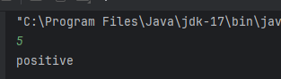
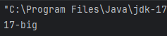
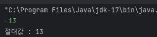
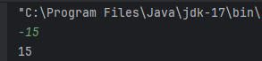
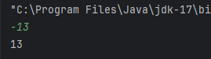

# Conditions

#### if

- if( 조건문 ) { statements }
- if( 조건문 ) { statements } else { statements }
- if( 조건문 ) { statements } else if ( 조건문 ) { statements }
- if( 조건문 ) { statements } else if ( 조건문 ) { statements } else { statements }

```kotlin
val a = 2
val b = 3

var max = a
if(a < b) max = b

// With else
if(a > b){
    max = a
} else {
    max = b
}
```

##### 실습

- 사용자로부터 정수를 입력 받아 음수면 "negative", 양수는 "positive", 0 은 "zero" 로 출력하는 프로그램을 작성하라

```kotlin
fun condition(number: Int): String{
    if(number < 0)
        return "negative"
    else if(number == 0)
        return "zero"
    else
        return "positive"
}

fun main() {
    val number = readln().toInt()
    println(condition(number))
}
```



<br />

- 1부터 20사이의 임의의 정수를 생성하여 10 이상이면 "숫자-big" 그 외는 "숫자-small" 이라 출력하라
- Range의 Random은 다음 코드 참조

```kotlin
val value = (1..20).random()
```

```kotlin
fun condition(number: Int): String {
    return if (number >= 10) {
        "${number}-big"
    } else {
        "${number}-small"

    }
}

fun main() {
    val number = (1..20).random()
    println(condition(number))
}
```



<br />

- kotlin에서 if 문은 expression 이다
- expression으로 사용할 때는 반드시 if-else 구조를 사용한다

```kotlin
// As expression
val max = if (a > b) a else b
```

```kotlin
val max = if (a > b) {
	print("Choose a")
    a // 블록의 마지막 expression의 값이 if의 값
} else {
    print("Choose b")
    b // 블록의 마지막 expression의 값이 else의 값
}
```

<br />

- 사용자로부터 정수를 입력받아 절대값을 출력하라

```kotlin
fun main() {
    var number = readln().toInt()
    if(number < 0) number = -number
    print("절대값 : $number")
}
```



<br />

- 사용자로부터 정수(value)를 입력받는다
- if 문을 expression으로 사용하여 다른 변수(abs)에 value의 절대값을 할당한다
- abs 의 값을 출력하라

```kotlin
fun main() {
    var value = readln().toInt()
    var abs = if (value < 0) -value else value
    print(abs)
}
```



<br />

- 파라미터로 받은 정수의 절대값을 반환하는 함수 abs를 정의하라. 단, 함수 Body 대신 expression을 사용하라
- 사용자로부터 정수를 입력받아 abs 함수를 사용한 결과를 출력하라

```kotlin
fun abs(value: Int) = if (value < 0) -value else value

fun main() {
    val value = readln().toInt()
    println(abs(value))
}
```



<br />

#### when

- 여러 조건을 처리하는 조건문. expression 으로 사용 가능
- C / Java에서의 switch 와 유사하지만 더 많은 기능을 제공한다

```kotlin
when(x) {
	1(조건) -> print("x == 1")
    2(조건) -> print("x == 2")
    else -> {
        print("x is neither 1 nor 2")
    }
}
```

- expression으로 사용할 때는 모든 경우의 수를 다루어야 한다
  - enum의 경우 모든 경우를 다루면 else 생략 가능
  - 그 외 모든 경우를 다 다루거나 else 조건 사용
- 두 가지 이상의 조건을 한번에 처리 가능

```kotlin
when(x) {
    0, 1 -> print("x == 0 or x == 1")
    else -> print("otherwise")
}
```

- in 연산자를 이용해 Collection 타입 내에 포함 여부 확인 가능

```kotlin
when(x) {
    in 1..10 -> print("x is in the range")
    in validNumbers -> print("x is valid")
    !in 10..20 -> print("x is outside the range")
    else -> print("none of the above")
}
```

- is 연산자를 이용해 타입 체크 가능

```kotlin
fun hasPrefix(x: Any) = when(x) {
    is String -> x.startsWith("prefix")
    else -> false
}
```


