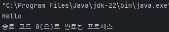

# 코틀린(Kotlin)

#### Statement & Expression

##### 표현식(Expression)과 서술문(Statement)
- Statement - 진술, 서술, 서술문
  - 실행 가능한(Executable) 최소의 독립적인 코드
  - for 문과 같은 제어문 등이 포함된다
- Expression - 식, 수식, 표현식
  - Statement의 부분 집합
  - 평가(Evaluation)을 통해 하나의 '값' 이 되는 코드 - 수학 연산, 함수 호출 등
  - 코드 작성 기준으로 생각하면 결국 값이 되는가? 를 생각해보면 된다
- 언어별로 표현식의 종류가 다르다
  - 할당문의 예
    - C: Expression
    - Java : Expresion
    - Python3 : Statement
    - Kotlin : Statement: print 하거나 if 문에 사용하거나 연속할당 할 수 없다

<br />

#### 문법

##### 기본 정보
- 파일의 확장자는 kt 이다
- 파일 이름과 클래스 이름이 같지 않아도 된다
- 한 파일에 두 개 이상의 클래스를 선언할 수 있다
  - 한 파일에 클래스가 하나만 있는 경우 파일과 클래스 이름을 같게 하는 것을 권장한다
- 클래스에 소속되지 않는 함수, 변수가 있다
  - Top level function, vatiable 이라 부른다
- 문장 끝에 ;(세미콜론)을 생략할 수 있다

<br />

##### 기본 문법
- 소스코드 제일 상단에 package 선언, 그 다음 import 구문들을 적는다
```kotlin
package com.example.hellokotlin

import kotlin.text.*
```
- 폴더 구조와 패키지 구조가 같지 않아도 된다
  - 일치 시키는 것을 권장
- Console 앱의 진입점은 main 함수이다
```kotlin
fun main() {
  println("start")
}
```
- 타입은 이름 : Type 의 형식을 따른다
  - 변수
```kotlin
val a: Int = 1
var name: String = "Hello World"
```
  - 할당되는 값을 통해 타입을 추론할 수 있는 경우 타입 표기를 생략할 수 있다
```kotlin
val b = 2
```
- 함수의 반환 타입
```kotlin
fun sum(a: Int, b: Int): Int {
  return a + b
}
```
- 특별한 값을 반환하지 않는 함수는 Unit 타입을 사용하거나 생략할 수 있다

<br />

- 변수 
  - 한 번만 할당 할 수 있는지, 여러 번 할당 할 수 있는지에 따라 선언이 다르다
  - val : 한 번만 값 할당 가능
```kotlin
val a: Int = 1 // immediate assignment
val b = 2 // 'Int' type is inferred
val c: Int // Type required when no initializer is provided
c = 3 // deferred assignment
// 즉시 초기화하지 않을 경우 타입 필수!
```
- var : 여러 번 할당 가능
```kotlin
var x = 5 // 'Int' type is inferred
x += 1
```
- 기본 출력 : print, println
```kotlin
print("Hello") // 줄바꿈x
print("world!")
```
```kotlin
println("Hello world!") // 자동 줄바꿈
println(42)
```
- 기본 입력 : readln():String
- Java의 주석(//과 /**/)을 모두 지원하며 /**/ 주석의 경우 중첩할 수 있다
```kotlin
/* The comment starts here
/* contains a nested comment */
and ends here. */
```

<br />

##### 실습
- message 변수에 "Hello" 를 할당하고 print 문을 이용해 출력하세요
```kotlin
fun main() {
    val message:String = "Hello"
    print(message)
}
```


<br />

#### Basic Types

##### Null Safety
- kotlin 의 모든 타입은 기본적으로 null을 허용하지 않는 타입
- null을 허용하고자 할 떄는 기본 타입 뒤에 ? 를 추가하여 선언한다
```kotlin
var city: String = "Korea"
var state: String? = null
```
- null을 허용하는 타입의 경우 사용할 떄 null 여부를 체크해야 한다

<br />

- null 대응
  - if를 이용해 null 체크하고 사용
```kotlin
val l = if(b != null) b.length else -1
// b가 null이 아닐 경우 b의 길이를 반환하고 null일 경우 -1 반환
```
- Sage call(?) 연산자를 이용한 안전한 멤버 함수 사용
```kotlin
val b: String? = null
println(b?.length)
// null 을 할당하는 것이 문제가 아니라 null 인데 Property나 함수를 사용하는 것이 문제
```

<br />

- null 대응하기
  - Elvis 연산자 (?:)를 이용
    - 연산자 앞의 값이 널이 아니면 사용하고 null 이면 연산자 뒤에 값을 사용
```kotlin
val l = if(b != null) b.length else -1

->

val l = b?.length ?: -1
```

- Not null assertion operator(!!)
  - null 허용 타입을 null 이 아닌 타입으로 변환해 반환
```kotlin
var value:String? = "ABC"
val value2 = value!!
// 코드의 동작 순서 상 절대 null 이 아닌 상황에서만 사용 !!를 사용할 당시 null 인 경우 Exception이 발생한다
```

<br />

##### Any, Numbers
- Kotlin의 최상위 클래스. Java의 Object 클래스에 해당하는 클래스이다
  - Any? : Nullable 한 모든 클래스들의 최상위 객체
  - Any : Null을 허용하지 않는 모든 클래스들의 최상위 객체
- 숫자 : Kotlin에서는 Int, Float 등도 모두 클래스이다
  - Null 이 아닌 숫자는 java의 int, float 등으로 처리 된다
  - Nullable 숫자인 경우 java의 Integer, Double 등의 클래스 객체로 생성된다

<br />

##### 기본 타입
- 정수형 타입


